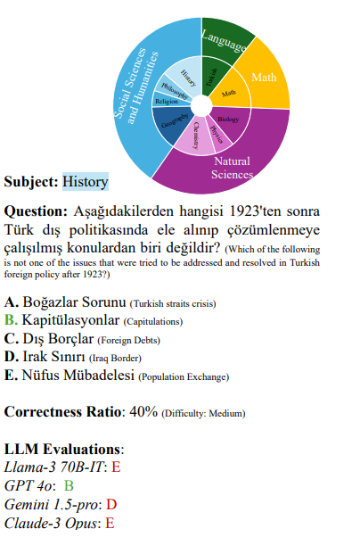

# TurkishMMLU

This repository contains Code and Data Analysis of TurkishMMLU for EMNLP 2024 Findings and ACL 24 SIGTURK Workshop. TurkishMMLU is a multiple-choice dataset for Turkish Natural Language Processing (NLP) community based on Turkish Highschool Curricula for nine subjects.

To access this dataset please send an email to:
arda.yueksel@tum.de or akoksal@cis.lmu.de.

## Abstract

Multiple choice question answering tasks evaluate the reasoning, comprehension, and mathematical abilities of Large Language Models (LLMs). While existing benchmarks employ automatic translation for multilingual evaluation, this approach is error-prone and potentially introduces culturally biased questions, especially in social sciences. We introduce the first multitask, multiple-choice Turkish QA benchmark, TurkishMMLU, to evaluate LLMs' understanding of the Turkish language. TurkishMMLU includes over 10,000 questions, covering 9 different subjects from Turkish high-school education curricula. These questions are written by curriculum experts, suitable for the high-school curricula in Turkey, covering subjects ranging from natural sciences and math questions to more culturally representative topics such as Turkish Literature and the history of the Turkish Republic. We evaluate over 20 LLMs, including multilingual open-source (e.g., Gemma, Llama, MT5), closed-source (GPT 4o, Claude, Gemini), and Turkish-adapted (e.g., Trendyol) models. We provide an extensive evaluation, including zero-shot and few-shot evaluation of LLMs, chain-of-thought reasoning, and question difficulty analysis along with model performance. We provide an in-depth analysis of the Turkish capabilities and limitations of current LLMs to provide insights for future LLMs for the Turkish language. We publicly release our code for the dataset and evaluation

## Dataset



Dataset is divided into four categories Natural Sciences, Mathematics, Language, and Social Sciences and Humanities with a total of nine subjects in Turkish highschool education. It is available in multiple choice for LLM evaluation. The questions also contain difficulty indicator referred as Correctness ratio.

## Evaluation

5-Shot evaluation results from the paper includes open and closed source SOTA LLM with different architectures. For this study, multilingual and Turkish adapted models are tested.

| Model               | Source | Average | Natural Sciences | Math | Turkish L & L | Social Sciences and Humanities |
| ------------------- | ------ | ------- | ---------------- | ---- | ------------- | ------------------------------ |
| GPT 4o              | Closed | 83.1    | 75.3             | 59.0 | 82.0          | 95.3                           |
| Claude-3 Opus       | Closed | 79.1    | 71.7             | 59.0 | 77.0          | 90.3                           |
| GPT 4-turbo         | Closed | 75.7    | 70.3             | 57.0 | 67.0          | 86.5                           |
| Llama-3 70B-IT      | Closed | 67.3    | 56.7             | 42.0 | 57.0          | 84.3                           |
| Claude-3 Sonnet     | Closed | 67.3    | 67.3             | 44.0 | 58.0          | 75.5                           |
| Llama-3 70B         | Open   | 66.1    | 56.0             | 37.0 | 57.0          | 83.3                           |
| Claude-3 Haiku      | Closed | 65.4    | 57.0             | 40.0 | 61.0          | 79.3                           |
| Gemini 1.0-pro      | Closed | 63.2    | 52.7             | 29.0 | 63.0          | 79.8                           |
| C4AI Command-r+     | Open   | 60.6    | 50.0             | 26.0 | 57.0          | 78.0                           |
| Aya-23 35B          | Open   | 55.6    | 43.3             | 31.0 | 49.0          | 72.5                           |
| C4AI Command-r      | Open   | 54.9    | 44.7             | 29.0 | 49.0          | 70.5                           |
| Mixtral 8x22B       | Open   | 54.8    | 45.3             | 27.0 | 49.0          | 70.3                           |
| GPT 3.5-turbo       | Closed | 51.0    | 42.7             | 39.0 | 35.0          | 61.8                           |
| Llama-3 8B-IT       | Open   | 46.4    | 36.7             | 29.0 | 39.0          | 60.0                           |
| Llama-3 8B          | Open   | 46.2    | 37.3             | 30.0 | 33.0          | 60.3                           |
| Mixtral 8x7B-IT     | Open   | 45.2    | 41.3             | 28.0 | 39.0          | 54.0                           |
| Aya-23 8B           | Open   | 45.0    | 39.0             | 23.0 | 31.0          | 58.5                           |
| Gemma 7B            | Open   | 43.6    | 34.3             | 22.0 | 47.0          | 55.0                           |
| Aya-101             | Open   | 40.7    | 31.3             | 24.0 | 38.0          | 55.0                           |
| Trendyol-LLM 7B-C-D | Open   | 34.1    | 30.3             | 22.0 | 28.0          | 41.5                           |
| mT0-xxl             | Open   | 33.9    | 29.3             | 28.0 | 21.0          | 42.0                           |
| Mistral 7B-IT       | Open   | 32.0    | 34.3             | 26.0 | 38.0          | 30.3                           |
| Llama-2 7B          | Open   | 22.3    | 25.3             | 20.0 | 20.0          | 19.8                           |
| mT5-xxl             | Open   | 18.1    | 19.3             | 24.0 | 14.0          | 16.8                           |

## Citation

```
@inproceedings{yuksel-etal-2024-turkishmmlu,
    title = "{T}urkish{MMLU}: Measuring Massive Multitask Language Understanding in {T}urkish",
    author = {Y{\"u}ksel, Arda  and
      K{\"o}ksal, Abdullatif  and
      Senel, L{\"u}tfi Kerem  and
      Korhonen, Anna  and
      Schuetze, Hinrich},
    editor = "Al-Onaizan, Yaser  and
      Bansal, Mohit  and
      Chen, Yun-Nung",
    booktitle = "Findings of the Association for Computational Linguistics: EMNLP 2024",
    month = nov,
    year = "2024",
    address = "Miami, Florida, USA",
    publisher = "Association for Computational Linguistics",
    url = "https://aclanthology.org/2024.findings-emnlp.413/",
    doi = "10.18653/v1/2024.findings-emnlp.413",
    pages = "7035--7055",
    abstract = "Multiple choice question answering tasks evaluate the reasoning, comprehension, and mathematical abilities of Large Language Models (LLMs). While existing benchmarks employ automatic translation for multilingual evaluation, this approach is error-prone and potentially introduces culturally biased questions, especially in social sciences. We introduce the first multitask, multiple-choice Turkish QA benchmark, TurkishMMLU, to evaluate LLMs' understanding of the Turkish language. TurkishMMLU includes over 10,000 questions, covering 9 different subjects from Turkish high-school education curricula. These questions are written by curriculum experts, suitable for the high-school curricula in Turkey, covering subjects ranging from natural sciences and math questions to more culturally representative topics such as Turkish Literature and the history of the Turkish Republic. We evaluate over 20 LLMs, including multilingual open-source (e.g., Gemma, Llama, MT5), closed-source (GPT 4o, Claude, Gemini), and Turkish-adapted (e.g., Trendyol) models. We provide an extensive evaluation, including zero-shot and few-shot evaluation of LLMs, chain-of-thought reasoning, and question difficulty analysis along with model performance. We provide an in-depth analysis of the Turkish capabilities and limitations of current LLMs to provide insights for future LLMs for the Turkish language. We publicly release our code for the dataset and evaluation: https://github.com/ArdaYueksel/TurkishMMLU"
}
```


